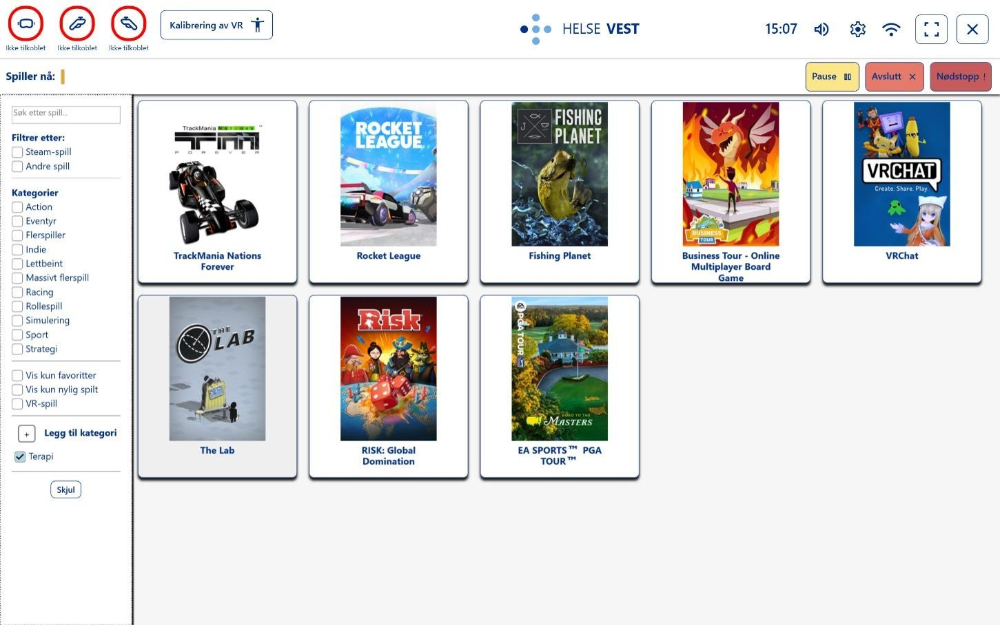
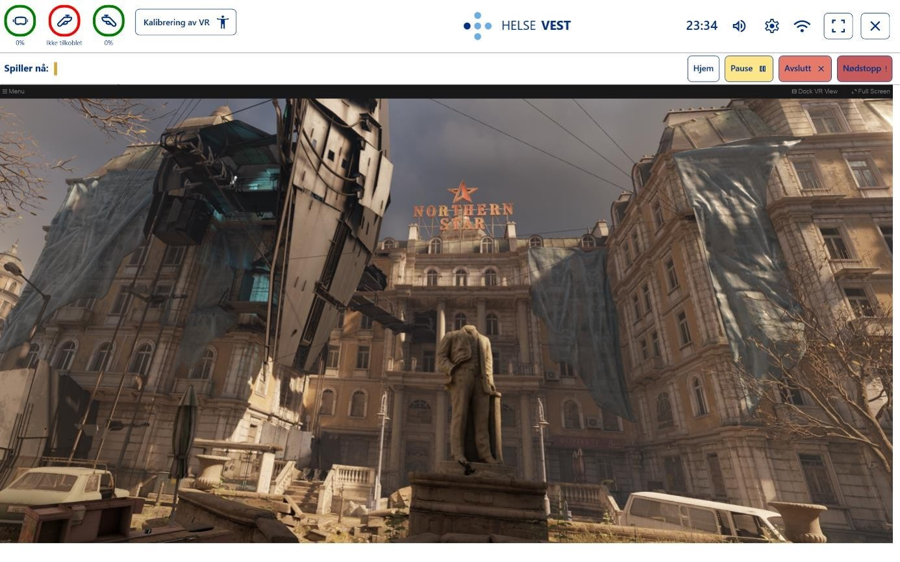

# HelseVestIKT Dashboard

HelseVestIKT Dashboard er ein Windows-applikasjon for å administrere og følgje opp spel- og VR-økter. Applikasjonen samlar tilgjengelege spel i ei oversiktleg hovudmeny og gir operatøren kontroll over ei aktiv økt frå éin stad. Formålet med applikasjonen er å gjere det enklare for helsepersonell å administrere og følgje opp VR-økter med barn og ungdom.

Prosjektet er utvikla som eit bachelorprosjekt i samarbeid med Helse Vest IKT.

## Skjermbilete

### Hovudmeny

Hovudmenyen viser dei tilgjengelege spela. Operatøren kan søkje, filtrere og organisere spel etter mellom anna kjelde, kategori og eigne samlingar.



### Tilskodarvising

Når eit spel er starta, viser dashboardet spelet i ei eiga tilskodarvising. Her kan operatøren følgje økta og bruke kontrollar for mellom anna pause, avslutting og nødstopp.



## Funksjonalitet

- Hente og vise spel frå Steam
- Støtte for lokale spel og spel som kan nyttast utan nettilgang
- Søk, filtrering og kategorisering av spel
- Administrasjon av fleire Steam-profilar, med lokal lagring av API-nøkkel, Steam-ID og sist brukte profil
- Oppstart og overvaking av spelprosessar
- Tilskodarvising av ei aktiv VR-økt
- Kontrollar for pause, avslutting og nødstopp
- Kalibrering av høgda i VR
- Statusvising for VR-headset, kontrollarar og nettverk
- Kontroll av systemlyd frå dashboardet
- Lokal logging av uventa feil

### Profilhandtering

Applikasjonen støttar fleire Steam-profilar, slik at ulike avdelingar kan halde konfigurasjonane sine skilde. Kvar profil inneheld eit profilnamn, ein Steam API-nøkkel og ein Steam-ID.

Brukaren får hjelp til å hente den nødvendige Steam-informasjonen gjennom applikasjonen. Profilane og den sist brukte profilen blir lagra lokalt, slik at opplysningane automatisk er tilgjengelege neste gong applikasjonen blir starta. API-svar og spelinformasjon blir i tillegg mellomlagra lokalt for å redusere behovet for å hente dei same dataa på nytt.

## Teknologi

Applikasjonen er utvikla for Windows med:

- C# og .NET 8
- Windows Presentation Foundation (WPF) og XAML
- MVVM-inspirert arkitektur
- Steam Web API og SteamKit2 for Steam-integrasjon
- WebView2 for Steam-innlogging og henting av Steam API-nøkkel
- OpenVR for kommunikasjon med VR-utstyr, status og kalibrering
- Win32-integrasjon for å byggje SteamVR si «VR View»-tilskodarvising inn i applikasjonen
- NAudio for lydkontroll
- Newtonsoft.Json for behandling av JSON-data
- NUnit og coverlet for automatiserte testar og testdekning

## Arkitektur

Koden er delt inn etter ansvar for å halde brukargrensesnitt, data og funksjonalitet skilde frå kvarandre:

- **Models** inneheld domenemodellar for mellom anna spel, spelgrupper, profilar og VR-status.
- **Views** inneheld WPF-vindauge og XAML-basert brukargrensesnitt.
- **ViewModels** bind data og handlingar til brukargrensesnittet.
- **Services** handterer Steam, VR, lyd, nettverk, filtrering, søk og spelprosessar.
- **Infrastructure** og **Interop** inneheld integrasjon mot Windows og OpenVR.
- **Helpers** inneheld delte hjelpeklassar og kommandoar.

## Prosjektstruktur

```text
.
├── docs/
│   └── images/                       # Bilete brukte i dokumentasjonen
├── HelseVestIKT-Dashboard/           # WPF-applikasjonen
│   ├── Assets/                       # Ikon, bilete og skrifttypar
│   ├── Helpers/                      # Hjelpeklassar og kommandoar
│   ├── Infrastructure/               # Windows- og VR-integrasjon
│   ├── Interop/                      # Bindingar mot OpenVR
│   ├── Models/                       # Domenemodellar
│   ├── Native/                       # Native bibliotek
│   ├── Resources/                    # Delte XAML-ressursar
│   ├── Services/                     # Applikasjonslogikk og integrasjonar
│   ├── ViewModels/                   # Presentasjonslogikk
│   └── Views/                        # Vindauge og brukargrensesnitt
├── HelseVestIKT_Dashboard.Tests/     # NUnit-testprosjektet
├── HelseVestIKT-Dashboard.sln        # Visual Studio-løysinga
└── README.md
```

## Køyring av prosjektet

Applikasjonen er utvikla og konfigurert for eit bestemt testmiljø. For å bruke alle funksjonane krevst mellom anna Steam, SteamVR, kompatibelt VR-utstyr og lokalt installerte spel.

Spelbiblioteket blir henta gjennom Steam Web API frå ein Steam-profil som vart brukt under utviklinga. Køyring av prosjektet krev derfor ein gyldig API-nøkkel og Steam-ID. Desse opplysningane er ikkje inkluderte i repositoriet.

Prosjektet kan difor krevje ytterlegare lokal konfigurasjon og er ikkje garantert å fungere direkte etter kloning. Skjermbileta ovanfor gir ei oversikt over hovudfunksjonane i applikasjonen.

## Testar

Testprosjektet inneheld einingstestar for mellom anna filtrering og gruppering av spel. Køyr alle testane frå rotmappa med:

```powershell
dotnet test HelseVestIKT-Dashboard.sln
```

## Personvern og tryggleik

API-nøklar, brukaropplysningar og lokale konfigurasjonsfiler skal ikkje leggjast inn i Git. Kontroller alltid endringane før dei blir publiserte.
